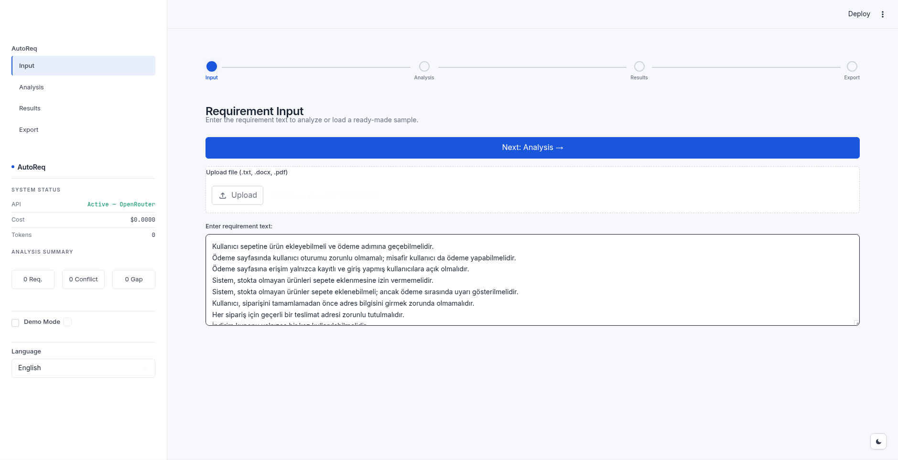
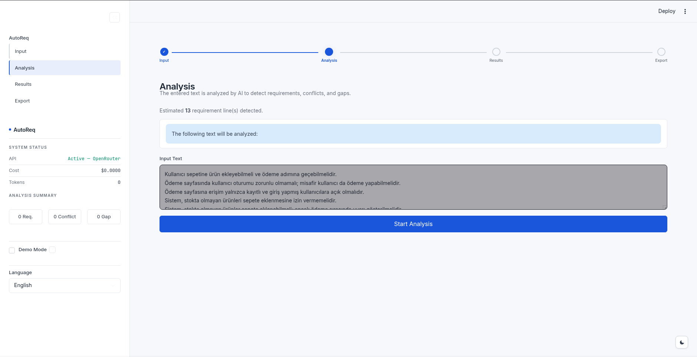
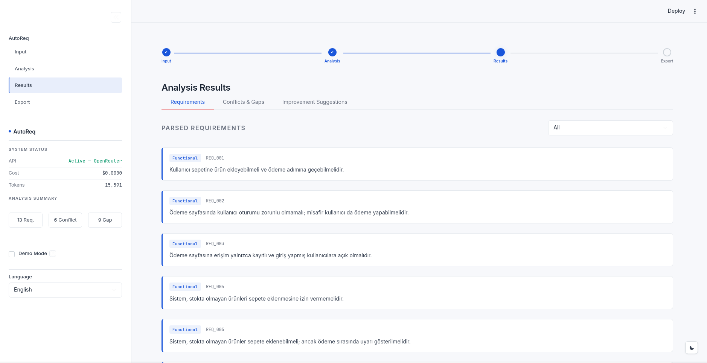
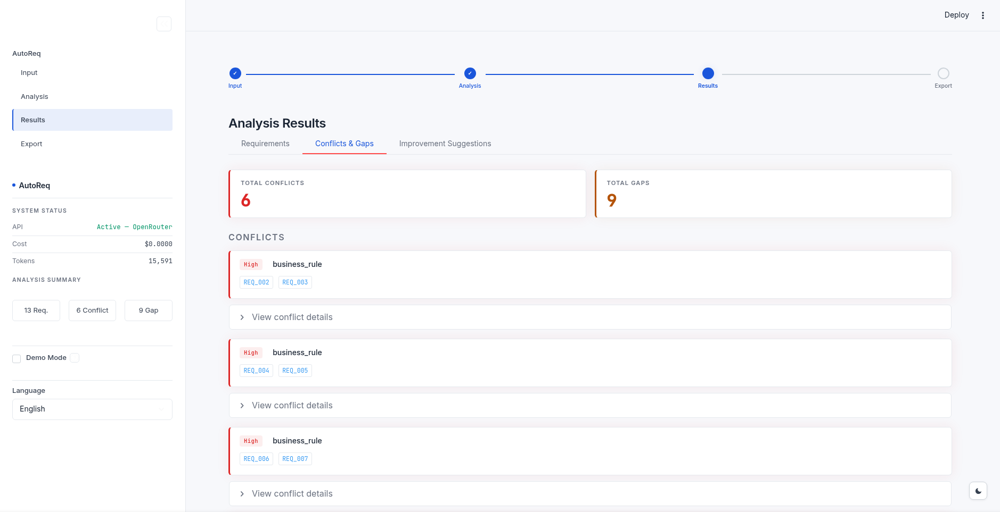
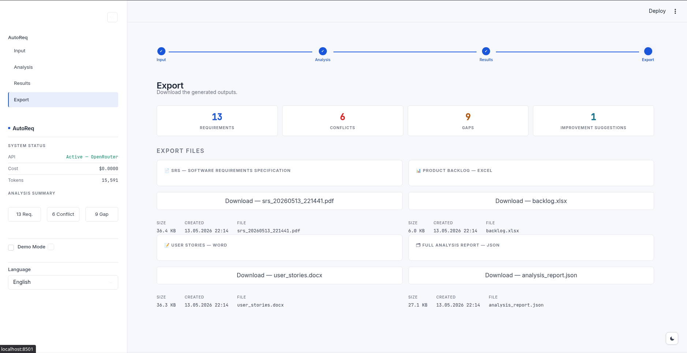

# AutoReq — Kontrol Noktası 5
## Demo, Kanıt, Akademik Çıktı

AutoReq Geliştirici Ekibi

---

## Çalışan Demo (MVP)

- Streamlit arayüzü, tek `process_text()` girişi
- Türkçe paydaş metni → Tek tıkla 4 farklı artefakt üretimi
- SRS (PDF/DOCX) · Kullanıcı Hikâyeleri · Gherkin BDD · Backlog (XLSX)
- Lemma tabanlı aktör çıkarımı + dependency-parse (özne odaklı `nsubj` filtrelemeli) ikinci geçiş
- Yerel KVKK maskeleme katmanı (T.C. Kimlik No ve İsim gizleme)
- Bellek içi belge üretimi (`io.BytesIO`) sayesinde eşzamanlı çakışmaların önlenmesi
- 3 katmanlı FR/NFR: fonksiyonel fiil → NFR regex → LLM fallback
- 3 LLM modülü paralel: ConflictDetector · GapAnalyzer · RequirementImprover

---

## Demo — 1. Giriş Ekranı

Paydaş metninin yapıştırıldığı Streamlit arayüzü.

---

## Demo — 2. Analiz Ekranı

Stanza önişleme + 3 LLM modülünün paralel çalıştığı analiz adımı.

---

## Demo — 3. Gereksinim Sonuçları

Cümle bazında aktör, iş nesnesi, FR/NFR etiketi ve iyileştirilmiş ifade.

---

## Demo — 4. Çelişki & Boşluk Sonuçları

ConflictDetector tipli çelişkileri, GapAnalyzer eksik akışları (domain kontrol listeleri enjeksiyonlu) raporluyor.

---

## Demo — 5. Dışa Aktarma

Tek geçişten 4 artefakt: ISO 29148 SRS (PDF/DOCX) · User Story · Gherkin · Backlog.

---

## Kanıt — Geliştirme Korpusu (244 Cümle / 8 Alan)

| Ölçüt | Sonuç |
|---|---|
| Aktör — Precision | %63.7 |
| Aktör — Recall | %41.6 |
| Aktör — F1 Skoru | %50.3 |
| FR/NFR Sınıflandırma Doğruluğu | %86.5 |
| Çelişki Tespiti (Recall) | %98.0 (TP: 49, FN: 1) |
| Çelişki Tespiti Kesinlik (Precision) | %94.2 (FP: 3) |
| Yanlış Pozitif Oranı (FPR) | %5.8 |

---

## Kanıt — Genelleme (Sağlık & Otomotiv, 113 Cümle Held-out)

Geliştirme ve optimizasyon süreçleri dışında tutuldu; sistem bu alanları ilk kez testte gördü.

| Ölçüt | Sonuç |
|---|---|
| FR/NFR Doğruluğu | %87.6 |
| Aktör Precision | %60.9 |
| Aktör Recall | %41.9 |
| Aktör F1 Skoru | %49.7 |

KVKK uyumluluğu · SLA hedefleri · otonom sürüş kısıtları gibi alana özgü NFR örüntüleri başarıyla yakalandı.

---

## Kanıt — Ablation

- LLM modülleri kapalı → Çelişki tespiti **%0**
- NLP-yalnız: **0.68 sn/cümle**
- Hibrit (LLM fallback dahil ortalama): **1.15 sn/cümle**
- LLM Fallback (Layer 3) işletilen cümleler: **2.45 sn/cümle**

LLM katmanı mantıksal analiz için vazgeçilmezdir; oluşan ek gecikme tekil belge kullanımında kullanıcı deneyimini etkilememektedir.

---

## Kanıt — Uyum Analizi (Human-AI Agreement)

- **Amaç:** Etiketleme kılavuzunun nesnelliğini ve tekrarlanabilirliğini doğrulamak
- **Yöntem:** Dev corpus'tan 8 alanı dengeli temsil eden **60 cümle**, bağımsız **Claude 3.5 Sonnet** tarafından sınıflandırıldı
- **Uyum Doğruluğu (Agreement):** **%96.67** (58 / 60 cümle birebir eşleşti)
- **Cohen's Kappa Katsayısı ($\kappa$):** **0.9251** ("Neredeyse Kusursuz Uyum")
- **Yorum:** Çıkan skor $\ge 0.81$ olduğu için kılavuz standartlarının kişisel yanlılıktan uzak, nesnel ve bilimsel olarak objektif olduğu kanıtlanmıştır.

---

## Akademik Paket

- IEEE formatında tam Türkçe makale taslağı (`docs/Makale/article_TR.txt`)
- Abstract · İlgili Çalışmalar · Mimari · Değerlendirme · Sonuç
- 11 referans, 4 figür ve 2 metrik tablosu
- Held-out sağlık korpusu ile genelleme deneyi
- Karşılaştırma tablosu ile literatürdeki konumun belirlenmesi

---

## Özet

Gereksinim hataları, yazılım projelerinin başarısızlığında başlıca nedenlerden biridir; paydaş görüşmelerini açık ve doğrulanabilir dokümanlara çevirme süreci ise uzun yıllardır temelde değişmedi. Bu çalışmada **Türkçe** girdileri uçtan uca otomatik işleyen **AutoReq** boru hattı sunulmaktadır — mevcut araçların büyük çoğunluğunun Türkçeyi desteklememesi literatürde göz ardı edilen bir boşluktur.

Sistem üç katmandan oluşur: Stanza tabanlı önişleme (cümle bölme, Türkçe küçük harfe dönüştürme, KVKK maskeleme, aktör/iş nesnesi çıkarımı, FR/NFR etiketleme); Gemini 2.5 Flash üzerinden paralel çalışan üç LLM modülü (ConflictDetector, GapAnalyzer, RequirementImprover); ve **ISO/IEC/IEEE 29148** uyumlu SRS, kullanıcı hikâyeleri, Gherkin BDD senaryoları ile ürün backlog'unu tek geçişte üreten üretim katmanı.

Sekiz alanı kapsayan 244 cümlelik geliştirme korpusunda **%86.5 FR/NFR doğruluğu**, aktör çıkarımında **%63.7 precision / %41.6 recall** ve **%98.0 çelişki tespiti** (%94.2 kesinlik, TP=49, FP=3) elde edilmiştir. Ayrı tutulan 113 cümlelik sağlık ve otonom sürüş korpusunda FR/NFR doğruluğu **%87.6**'ya, aktör F1 skoru ise **%49.7**'ye ulaşmıştır.

---

## Teşekkürler
