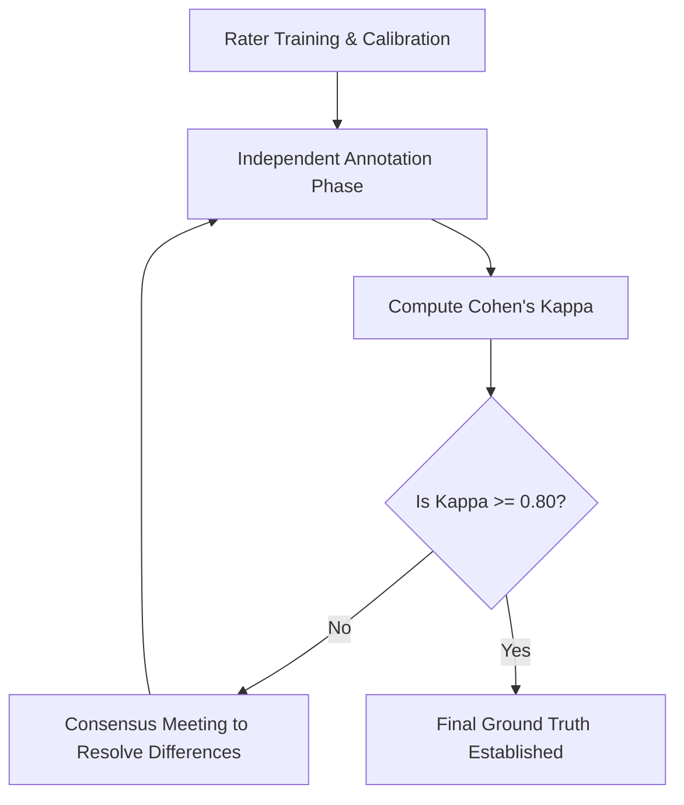

# AutoReq Annotation Guidelines & Bias Mitigation (Cohen's Kappa)

This document establishes the guidelines for human annotators to label the evaluation datasets (Dev and Held-out corpora) and outlines the process for calculating Inter-Rater Agreement (Cohen's Kappa) to mitigate individual annotation bias.

---

## 1. Objective

To evaluate the AutoReq NLP engine (Stanza-based classifier, NER, priority detector) and LLM-based analyzers (Conflicts, Gaps), we compare their predictions against a human-annotated ground truth. Because software requirements engineering is subject to interpretation, using a single annotator introduces bias. By employing multiple independent raters and measuring their agreement, we establish a robust, objective ground truth.

---

## 2. Annotation Roles and Classes

For each requirement sentence in the corpus, raters must independently label:

1. **Requirement Type (`req_type`):**
   - **`FUNCTIONAL`:** Specifies a function that a system or system component must be able to perform (e.g., "Kullanıcı sisteme giriş yapabilmeli.").
   - **`NON_FUNCTIONAL` (NFR):** Specifies quality attributes, constraints, or performance criteria (e.g., "Sistem 200 ms altında yanıt vermelidir.").

2. **Actors (`actors`):**
   - The entity (human user, external system, device) that performs the action (e.g., "yönetici", "müşteri").

3. **Objects (`objects`):**
   - The business entities or data items acted upon (e.g., "fatura", "şifre").

4. **Priority (`priority`):**
   - **`HIGH`**
   - **`MEDIUM`**
   - **`LOW`**

---

## 3. Inter-Rater Agreement Process

To ensure high-quality annotations, AutoReq projects follow a 4-step process:



### Step 1: Calibration Phase
- Both raters receive the definition checklist and annotate a small pilot sample (~10% of the corpus).
- Raters discuss disagreements to align their understanding of functional vs. non-functional requirements and actor boundaries.

### Step 2: Independent Annotation
- Raters independently annotate the full corpus without communicating.
- Annotations are recorded in separate files.

### Step 3: Compute Cohen's Kappa ($\kappa$)
For categorical classifications (like `req_type` and `priority`), Cohen's Kappa is calculated using:

$$\kappa = \frac{p_o - p_e}{1 - p_e}$$

Where:
- $p_o$ is the relative observed agreement among raters (accuracy of agreement).
- $p_e$ is the hypothetical probability of chance agreement.

#### Interpretation of Kappa Scores:
- **$\kappa \ge 0.81$:** Almost Perfect Agreement (Acceptable for ground truth).
- **$0.61 \le \kappa \le 0.80$:** Substantial Agreement (Review marginal cases).
- **$\kappa \le 0.60$:** Moderate/Fair Agreement (Unacceptable. Re-calibrate and re-annotate).

### Step 4: Discrepancy Resolution
- Items where raters disagree are flagged.
- A third expert (or consensus meeting) resolves the tie to output the final `ground_truth.json` file.

---

## 4. Python Implementation of Cohen's Kappa

Annotators can calculate the Kappa score using the following script (using `scikit-learn`):

```python
from sklearn.metrics import cohen_kappa_score

# Example labels from two raters
rater1_labels = ["FUNCTIONAL", "NON_FUNCTIONAL", "FUNCTIONAL", "FUNCTIONAL"]
rater2_labels = ["FUNCTIONAL", "NON_FUNCTIONAL", "NON_FUNCTIONAL", "FUNCTIONAL"]

kappa = cohen_kappa_score(rater1_labels, rater2_labels)
print(f"Cohen's Kappa: {kappa:.3f}")
```

---

## 5. Correcting Metric Discrepancies

To prevent discrepancies between the evaluation results in the text drafts of the academic manuscript (`article_TR.txt`) and the actual system results:
1. Every time changes are made to the NLP engines or classification rules, evaluation scripts (`scripts/eval_dev_corpus.py` and `scripts/eval_heldout_corpus.py`) must be run.
2. The outputs in `reports/dev_corpus_results.json` and `reports/heldout_corpus_results.json` must be updated.
3. The precision, recall, and accuracy numbers listed in the article tables must be updated to match the JSON results exactly.
